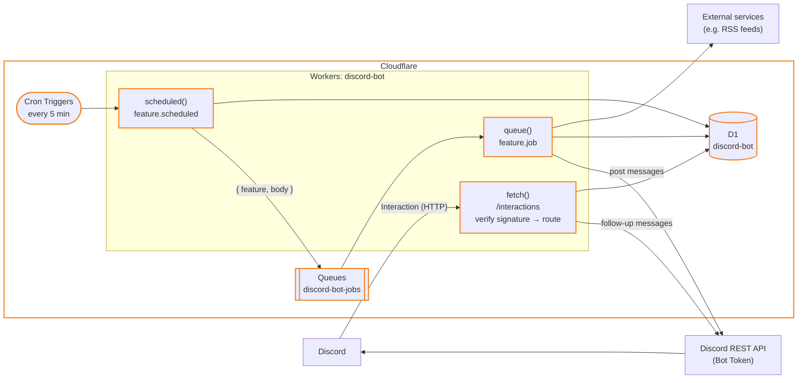

# Architecture

The bot is a single Cloudflare Worker. It receives Discord interactions over HTTP (no Discord Gateway (WebSocket) connection), and each capability is a self-contained feature module.

## Overview



| Entry point | Trigger | Dispatches to |
| --- | --- | --- |
| `fetch()` | Discord interaction (`POST /interactions`) | `feature.commands` / `feature.components` |
| `scheduled()` | Cron (every 5 min) | Command sync, then `feature.scheduled` of every feature |
| `queue()` | Queue message `{ feature, body }` | `feature.job` of the named feature |

Interaction requests are verified with the application's Ed25519 public key; invalid requests get `401`.

## Project structure

```
src/
  index.ts          entry points: fetch / scheduled / queue
  env.ts            binding types
  core/
    feature.ts      feature module interface
    router.ts       interaction routing
    commands.ts     command auto-registration
    verify.ts       request signature verification
    rest.ts         Discord REST API client
    responses.ts    interaction response helpers
    options.ts      command option helpers
  features/
    index.ts        enabled features
    rss/            RSS feature
migrations/         D1 schema
docs/
test/
```

## Feature modules

A feature implements `Feature` (`src/core/feature.ts`) and is registered in `src/features/index.ts`.

- `commands`: slash commands
- `components`: buttons, selects, etc. A `custom_id` of `<name>:<action>:<args...>` routes to `components[action]`
- `scheduled`: runs on each cron tick
- `job`: handles queue messages sent as `{ feature: "<name>", body }`

Feature-specific tables go in a new file under `migrations/`.

## Command registration

Slash commands are registered globally, so they appear in every server the bot is in. On each cron tick, the Worker hashes all command definitions and re-registers them only if the hash differs from the one stored in `app_state`. Changes go live within 5 minutes of a deploy.

## RSS feature

### Fetching

- `scheduled()` claims feeds whose `next_fetch_at` has passed, pushes it 10 minutes ahead, and enqueues one job per feed.
- Each job fetches the feed with conditional GET (ETag / Last-Modified) and parses RSS 2.0, RSS 1.0 (RDF) or Atom.
- Failures back off exponentially, up to 24 hours. `fail_count` and `last_error` are shown in `/rss list`.
- A feed is fetched once regardless of how many channels subscribe to it, and is deleted when its last subscription is removed.

### Deduplication

- Item keys are `guid` / Atom `id`, falling back to `link`.
- Seen keys are stored in `feeds.seen_keys` as a JSON array, newest first, capped at 200 (or the feed size, if larger). Previous keys are kept so that items briefly dropping out of the feed are not reposted.
- On subscribe, all current items are marked as seen.
- Seen keys are saved **before** posting. Failed posts are not retried: missed items are acceptable, duplicate posts are avoided.
- Queues guarantees at-least-once delivery, so a duplicate post is still possible if the same message is processed concurrently. This is rare and accepted.

### Posting

- At most 10 new items per fetch, oldest first; the rest are marked as seen.
- Items are posted as plain text, the bold title and the URL on the next line, so Discord unfurls each link (with thumbnail). Up to 5 items per message, to keep the number of posts per fetch low.
- `/rss add` posts a welcome message to the channel; if the bot cannot post there, the subscription is rolled back.
- `/rss preview` posts the latest items with the same formatting, without touching the database. Useful to check how notifications look.

## Data model

| Table | Row |
| --- | --- |
| `app_state` | App-wide key-value state (e.g. `commands_hash`) |
| `feeds` | A feed URL with fetch state (`etag`, `last_modified`, `seen_keys`, `next_fetch_at`, `fail_count`, `last_error`) |
| `subscriptions` | A feed subscribed in a channel. Unique per `(feed_id, channel_id)` |
